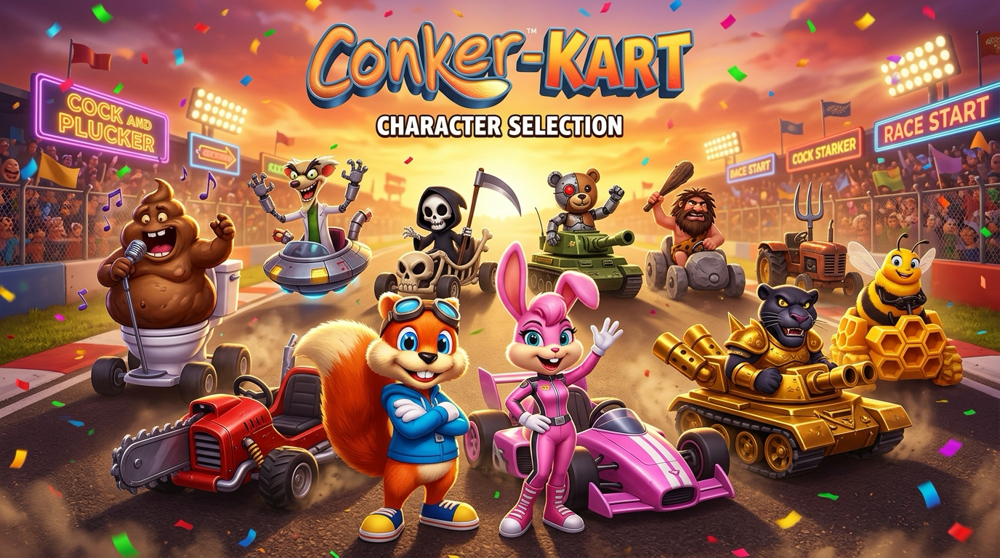

# 🏎️ Conker-Kart

[](LICENSE)
[](https://github.com/ricasolucoes)
[](https://supertuxkart.net)
[](https://blender.org)
[]()

> **Conker-Kart** é um jogo de corrida arcade com humor irreverente, construído sobre o consagrado motor open source **SuperTuxKart**, desenvolvido e mantido pela **Sierra Tecnologia** e publicado sob a organização **Rica Soluções**.

---

<p align="center">
  
</p>

---

## 🌟 O Roster Completo dos 10 Pilotos & Karts

O projeto conta com o elenco completo dos 10 personagens clássicos e chefes mais emblemáticos do universo de Conker, com modelos 3D poligonais gerados no **Blender 5.x**, arquivos de física, som e materiais configurados para o SuperTuxKart:

| Piloto | Kart | Imagem | Classe | Modelo 3D & Arquivos |
|---|---|:---:|---|---|
| **Conker** | **Nitro Rod** |  | **Médio** — Equilíbrio perfeito entre aceleração, nitro e drift. | `karts/conker/conker_chassis.obj`<br>`karts/conker/kart.xml` |
| **Berri** | **Pink Fury** |  | **Leve** — Alta agilidade em curvas fechadas e rápida recuperação. | `karts/berri/berri_chassis.obj`<br>`karts/berri/kart.xml` |
| **Panther King** | **Golden Royal Tank** |  | **Pesado** — Aríete frontal de impacto máximo e estabilidade sólida. | `karts/panther/panther_chassis.obj`<br>`karts/panther/kart.xml` |
| **The Great Mighty Poo** | **Porcelain Sludge Throne** |  | **Pesado** — O tenor do esgoto em sua privada veloz com rolos de papel higiênico. | `karts/mighty_poo/mighty_poo_chassis.obj`<br>`karts/mighty_poo/kart.xml` |
| **Prof. Von Kriplespac** | **Cyber Hovercraft** |  | **Leve** — Propulsores de plasma de alta velocidade e tentáculos robóticos. | `karts/von_kriplespac/kriplespac_chassis.obj`<br>`karts/von_kriplespac/kart.xml` |
| **Gregg the Grim Reaper** | **Bone Hearse** |  | **Médio** — Carruagem fúnebre de ossos, foice acoplada e chamas púrpuras. | `karts/gregg/gregg_chassis.obj`<br>`karts/gregg/kart.xml` |
| **Tediz Commander** | **War Half-Track** |  | **Pesado** — Blindagem militar de trincheira e escapes duplos estilo metralhadora. | `karts/tediz/tediz_chassis.obj`<br>`karts/tediz/kart.xml` |
| **Buga the Cavedude** | **Flintstone Smasher** |  | **Pesado** — Chassi de rocha esculpida com presas gigantes de mamute. | `karts/buga/buga_chassis.obj`<br>`karts/buga/kart.xml` |
| **Franky the Pitchfork** | **Hay Bale Tractor** |  | **Médio** — Trator agrícola enferrujado com fardos de feno e chaminé fumegante. | `karts/franky/franky_chassis.obj`<br>`karts/franky/kart.xml` |
| **King Bee** | **Honeycomb Stinger** |  | **Leve** — Voo acrobático em alta rotação sobre hexágonos de mel dourado. | `karts/king_bee/king_bee_chassis.obj`<br>`karts/king_bee/kart.xml` |

---

## 🎮 Como Jogar com os Karts no SuperTuxKart

Você pode testar e rodar todos os 10 karts diretamente no SuperTuxKart instalado no seu computador ou dispositivo Android:

1. Localize a pasta de addons do SuperTuxKart:
   - **Linux:** `~/.local/share/supertuxkart/addons/karts/`
   - **macOS:** `~/Library/Application Support/supertuxkart/addons/karts/`
   - **Windows:** `%APPDATA%/supertuxkart/addons/karts/`
   - **Android:** `/sdcard/Android/data/org.supertuxkart.stk/files/addons/karts/`
2. Copie todas as pastas de `karts/*` para o seu diretório `addons/karts/`.
3. Abra o SuperTuxKart: todos os 10 pilotos estarão disponíveis instantaneamente no menu de seleção!

---

## 🛠️ Ferramentas & Geração Procedural 3D (Blender 5.x)

Todos os modelos 3D (`.obj`, `.mtl`, rodas e colisores) são gerados de forma reproduzível via script Python para Blender:

```bash
# Executar a geração completa dos 10 karts no Blender:
blender --background --python tools/generate_models.py
```

---

## 🎬 Vídeo de Introdução & Google Flow / Veo

O repositório inclui o roteiro cinematográfico completo com prompts cena a cena para geração no **Google Flow** ([flow.google](https://flow.google)) com o modelo **Veo**:

* Consulte o guia em: [docs/GOOGLE_FLOW_VIDEO_PROMPTS.md](docs/GOOGLE_FLOW_VIDEO_PROMPTS.md)

---

## 📱 Publicação na Google Play Store

* Assets oficiais da loja (ícone 512x512, feature graphic 1024x500 e banner do roster) disponíveis em `assets/store/`.
* Guia de compilação do Android App Bundle (`.aab`) e submissão: [docs/PLAY_STORE_PUBLISHING_GUIDE.md](docs/PLAY_STORE_PUBLISHING_GUIDE.md).

---

## ⚖️ Licença & Atribuições

- **Código & Assets Derivados:** Licença **GNU General Public License v3 (GPLv3)**.
- **Motor Original:** [SuperTuxKart Team](https://supertuxkart.net).
- **Sierra Tecnologia & Rica Soluções:** Mantenedores do projeto, modelagem 3D, branding e porte Android.
