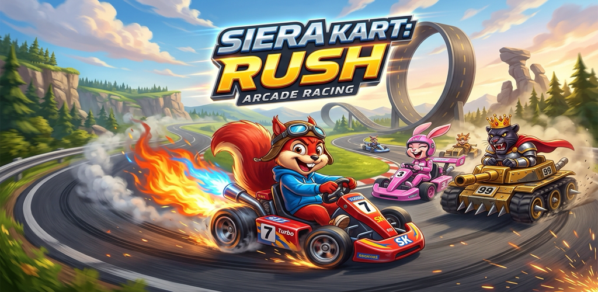

# 🏎️ Conker-Kart

[](LICENSE)
[](https://github.com/ricasolucoes)
[](https://supertuxkart.net)
[](https://blender.org)
[]()

> **Conker-Kart** é um jogo de corrida arcade com humor irreverente, construído sobre o consagrado motor open source **SuperTuxKart**, desenvolvido e mantido pela **Sierra Tecnologia** e publicado sob a organização **Rica Soluções**.

---

<p align="center">
  
</p>

---

## 🌟 Destaques & Personagens

O projeto inclui karts e pilotos estilizados, modelados em 3D e preparados para a física do SuperTuxKart:

| Piloto & Kart | Imagem | Classe | Modelo 3D & Arquivos |
|---|:---:|---|---|
| **Conker (Nitro Rod)** |  | **Médio** — Equilíbrio perfeito entre aceleração e drift. | `karts/conker/conker_chassis.obj`<br>`karts/conker/kart.xml` |
| **Berri (Pink Fury)** |  | **Leve** — Alta velocidade nas curvas e arranque ágil. | `karts/berri/berri_chassis.obj`<br>`karts/berri/kart.xml` |
| **Panther King (Golden Tank)** |  | **Pesado** — Máxima força de impacto e alta estabilidade. | `karts/panther/panther_chassis.obj`<br>`karts/panther/kart.xml` |

---

## 🎮 Como Jogar com os Karts no SuperTuxKart

Você pode testar e rodar os karts do Conker-Kart diretamente no SuperTuxKart no seu computador ou no Android:

1. Localize a pasta de addons do SuperTuxKart:
   - **Linux:** `~/.local/share/supertuxkart/addons/karts/`
   - **macOS:** `~/Library/Application Support/supertuxkart/addons/karts/`
   - **Windows:** `%APPDATA%/supertuxkart/addons/karts/`
   - **Android:** `/sdcard/Android/data/org.supertuxkart.stk/files/addons/karts/`
2. Copie as pastas `karts/conker`, `karts/berri` e `karts/panther` para o diretório `addons/karts/`.
3. Abra o SuperTuxKart: os pilotos aparecerão na tela de seleção de personagens!

---

## 🛠️ Ferramentas & Geração Procedural 3D

Os modelos 3D (`.obj`, materiais `.mtl`, colisores e rodas) são gerados programaticamente utilizando a API Python do Blender:

```bash
# Executar a geração automática dos modelos 3D via Blender:
blender --background --python tools/generate_models.py
```

---

## 🎬 Vídeo de Introdução & Google Flow

O repositório inclui o roteiro completo e prompts detalhados para gerar o trailer cinematográfico de abertura no **Google Flow** ([flow.google](https://flow.google)) com o modelo **Veo**:

* Consulte o documento: [docs/GOOGLE_FLOW_VIDEO_PROMPTS.md](docs/GOOGLE_FLOW_VIDEO_PROMPTS.md)

---

## 📱 Publicação na Google Play Store

* Todos os assets exigidos pela loja (ícone 512x512, feature graphic 1024x500 e capturas de tela) estão prontos em `assets/store/`.
* Guia detalhado de publicação, Keystore e ficha da loja: [docs/PLAY_STORE_PUBLISHING_GUIDE.md](docs/PLAY_STORE_PUBLISHING_GUIDE.md).

---

## ⚖️ Licença & Atribuições

- **Código & Assets Derivados:** Distribuído sob a licença **GNU General Public License v3 (GPLv3)**.
- **Motor Original:** [SuperTuxKart Team](https://supertuxkart.net).
- **Sierra Tecnologia & Rica Soluções**: Responsável pelo fork, modelagem procedural, branding e empacotamento Android.
